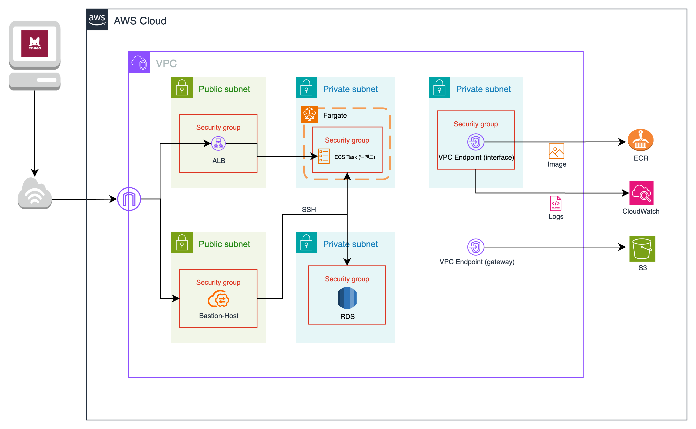
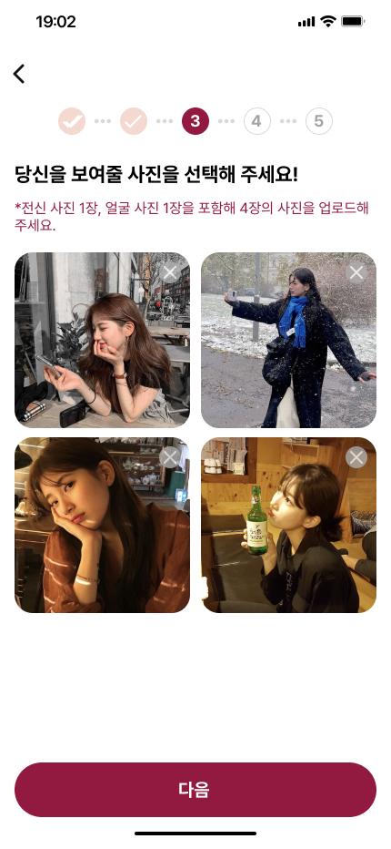
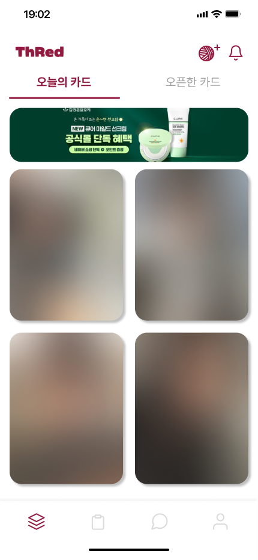
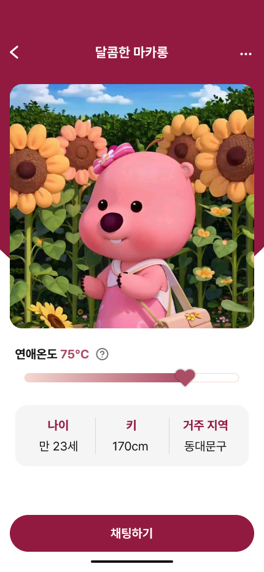
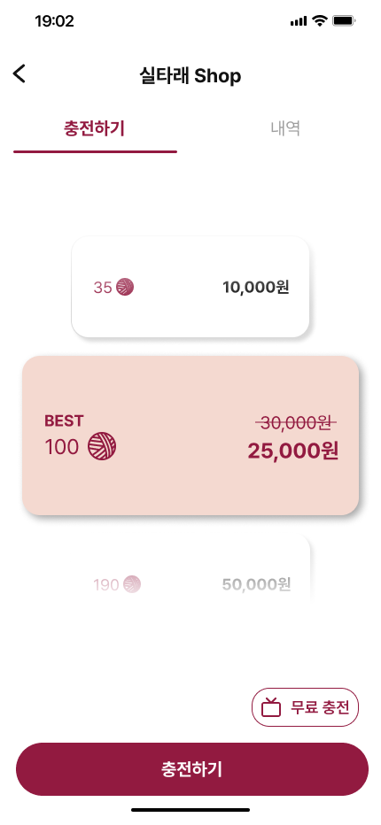
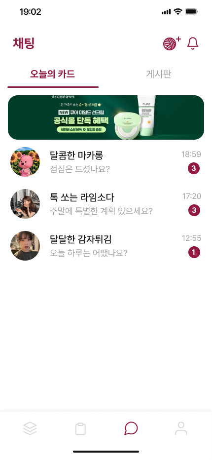

# Server Architecture

# ERD

# 프로젝트 관련 이슈 정리

1. EC2 메모리 부족 서버 다운 이슈\
   https://www.notion.so/EC2-18b8b5fff9ef817996a1eebda92487b9?v=1b48b5fff9ef808eb6d4000cfd4b597b&source=copy_link

2. Jenkins 설정 파일 복사 중 권하 오류 이슈\
   https://www.notion.so/Jenkins-18b8b5fff9ef811f90d7d25b7a9ec7b4?v=1b48b5fff9ef808eb6d4000cfd4b597b&source=copy_link

3. 프론트 AWS S3 접근 제한 권한 문제\
   https://www.notion.so/AWS-S3-18b8b5fff9ef81af9b84f654d1acbe1c?v=1b48b5fff9ef808eb6d4000cfd4b597b&source=copy_link

4. Redis 직렬화, 역직렬화 타입 문제\
   https://www.notion.so/Redis-2e387e4fddfe4a3f9fe3c6671e1f8b49?v=1b48b5fff9ef808eb6d4000cfd4b597b&source=copy_link

5. S3 URL 한글 깨짐 이슈\
   https://www.notion.so/S3-URL-19b8b5fff9ef80de8d0eceee3f49ccc8?v=1b48b5fff9ef808eb6d4000cfd4b597b&source=copy_link

6. Multipart 이슈(@RequestPart VS @RequestParam)\
   https://www.notion.so/Multipart-RequestPart-VS-RequestParam-19b8b5fff9ef80b1ab70f8be9b0af9ba?v=1b48b5fff9ef808eb6d4000cfd4b597b&source=copy_link

7. Application 설정 파일 AWS ParameterStore 사용법\
   https://www.notion.so/Application-AWS-ParameterStore-1a38b5fff9ef80c1a4d4d52171ee451c?v=1b48b5fff9ef808eb6d4000cfd4b597b&source=copy_link

8. EC2 도커 환경에서 AWS ParameterStore 이슈\
   https://www.notion.so/EC2-AWS-ParameterStore-1a78b5fff9ef80b681f5c4960637d11f?v=1b48b5fff9ef808eb6d4000cfd4b597b&source=copy_link

9. 채팅 메시지 Json Converter 에러 이슈\
   https://www.notion.so/Json-Converter-1e08b5fff9ef80fbb8ecf6aa504d4fdd?v=1b48b5fff9ef808eb6d4000cfd4b597b&source=copy_link

10. AWS ECS관련 오류\
    https://www.notion.so/AWS-ECS-1f08b5fff9ef801ca431cd2dc88cf38e?v=1b48b5fff9ef808eb6d4000cfd4b597b&source=copy_link
11. 애플리케이션 실행 중단 현상\
https://www.notion.so/2188b5fff9ef801aa02ffbee42da0c3f?v=1b48b5fff9ef808eb6d4000cfd4b597b&source=copy_link

# 프로젝트 디자인

